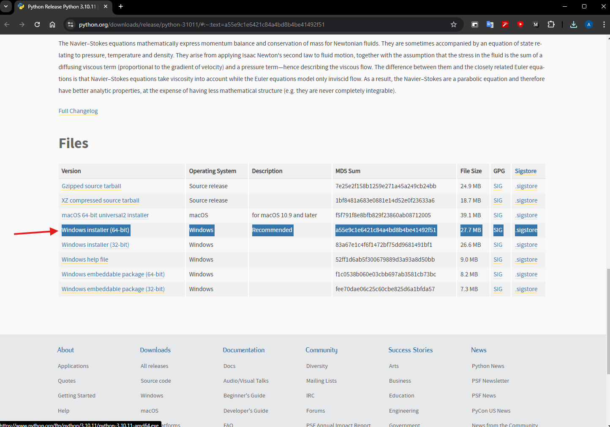
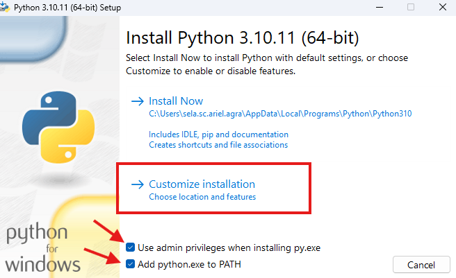
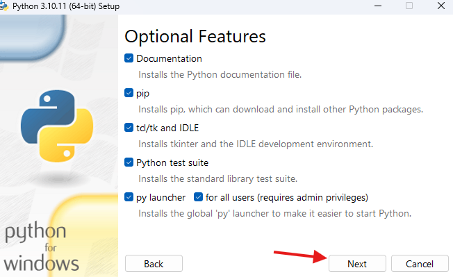
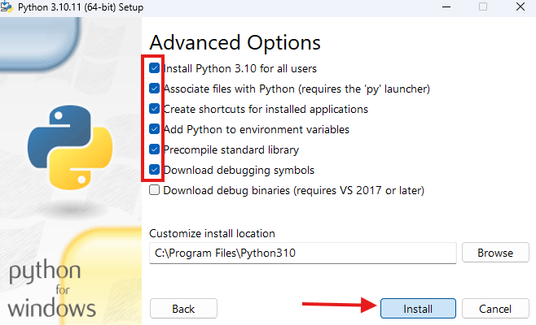
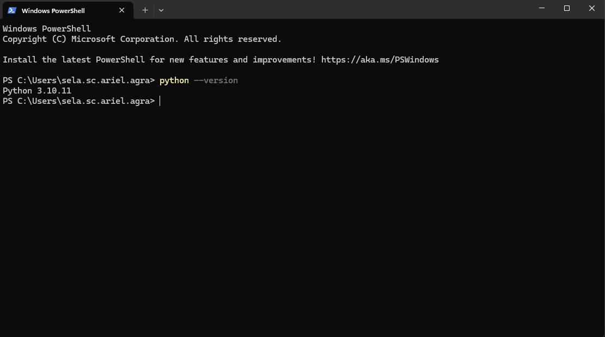
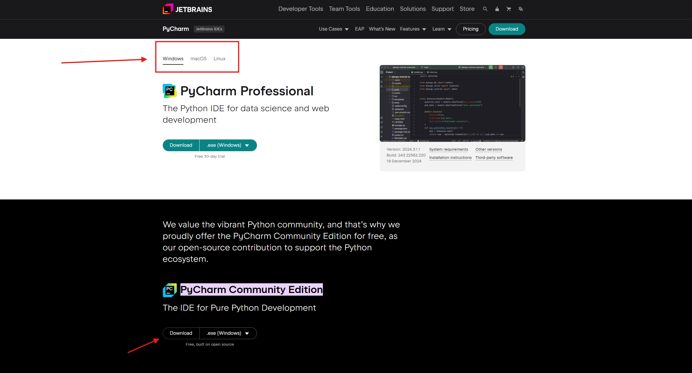
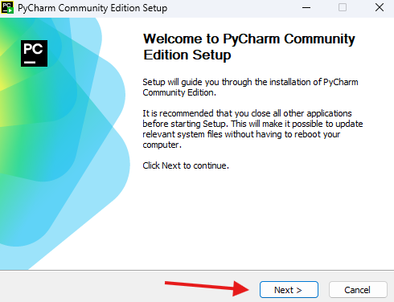
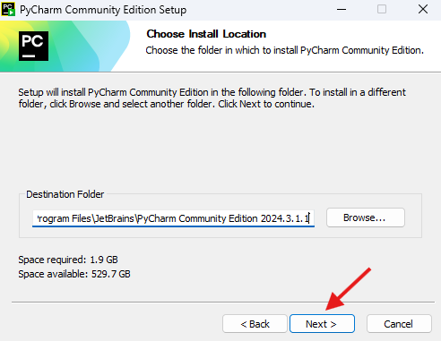
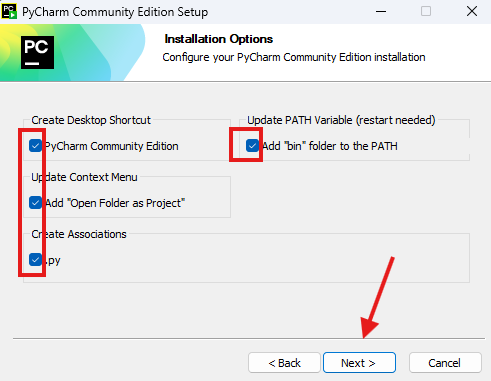
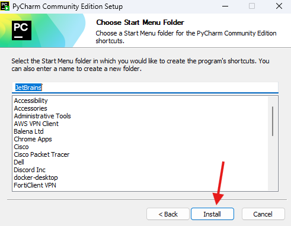

## Install python 3.10.11

Use [this link](https://www.python.org/downloads/release/python-31011/#:~:text=a55e9c1e6421c84a4bd8b4be41492f51) to download and install the 64 bit version (or mac version, if on mac).

1) Open "python-3.10.11.exe" as administrator (right click and choose "run as administrator")

    Check the boxes shown on the picture below, and use "Customize installation"

2) Here also check everything :)

3) Check the needed boxes and continue

4) You can verify you have the needed version by going to powershell/cmd and writing 

    `python --version`

## Install pycharm (community edition)
1) Go to [this link](https://www.jetbrains.com/pycharm/download/?section=windows#:~:text=the%20Python%20ecosystem.-,PyCharm%20Community%20Edition,-The%20IDE%20for) and download pycharm **community edition**.

2) check boxes

That's it! Good luck!